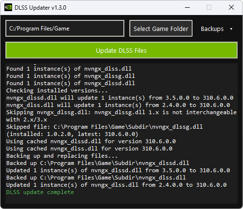

# DLSS Updater

A simple open-source desktop tool to find and update NVIDIA DLSS files in your game folders.

---

## Features

- Recursively scans a selected game folder
- Detects:
  - `nvngx_dlss.dll`
  - `nvngx_dlssg.dll`
  - `nvngx_dlssd.dll`
- Compares installed versions against the latest release
- Safely updates DLSS files with version compatibility checks:
  - 1.x versions are only updated within 1.x
  - 2.x and 3.x versions are treated as compatible
  - Blocks unsafe cross-version updates that can break older titles
- Automatically creates per-file backups before updating
- Restore original DLSS files from backups at any time

---

## Screenshot



---

## Download

Download the latest version from the Releases page:

https://github.com/sparepillowgit/dlss-updater/releases/latest

---

## Usage

1. Launch the application
2. Click **"Select Game Folder"**
3. Select your game installation directory
4. Click **"Update DLSS Files"**

---

## Notes

- You may need to run as **Administrator**
- The app will skip downloading files if they are already cached
- Only files that need updating will be replaced

---

## Build from Source

### Requirements

- Python 3.10+
- pip

### Create a clean build environment

```bash
python -m venv .venv
.venv\Scripts\activate
python -m pip install --upgrade pip pyinstaller
rmdir /s /q build
rmdir /s /q dist
del /q *.spec
```

### Build command

```
pyinstaller --clean --noconfirm --onefile --windowed --name dlss-updater --icon=icon.ico --version-file=version_info.txt --add-data "icon.ico;." main.py
```

### Output

The built application will be created in:

```
dist\dlss-updater\
```

Run the executable from that folder:

```
dist\dlss-updater\dlss-updater.exe
```